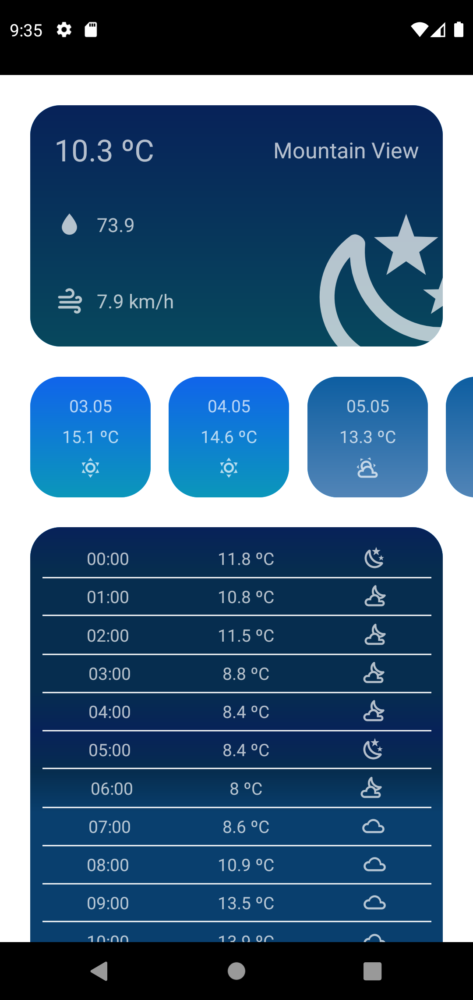
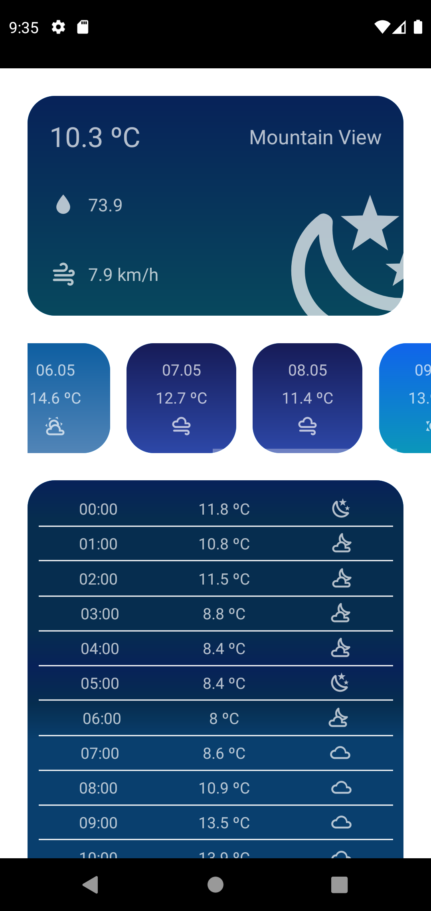
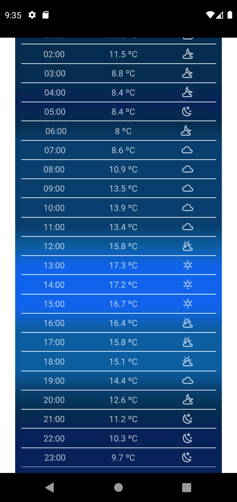
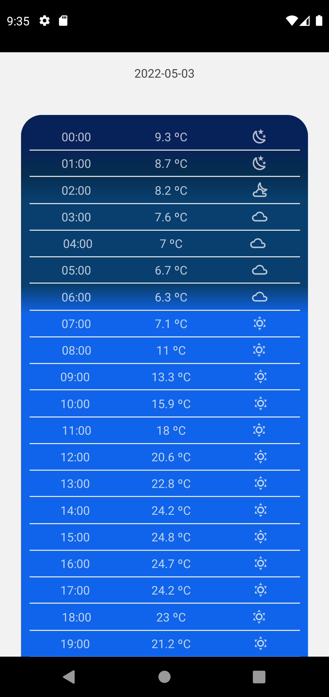

# react-native-weather
Weather app built in react native

## APIs used
### Reverse Geocoding -> [BigDataCloud](https://api.bigdatacloud.net/data/reverse-geocode-client?latitude=53.6036036036036&longitude=18.644514333816108&localityLanguage=pl)
### Weather data -> [VisualCrossing](https://www.visualcrossing.com/weather-api?ga_api10&gclid=Cj0KCQjwgYSTBhDKARIsAB8KukviK7WVXQPWr_YxgoOWlTA9BL-RMphUVdHG2jphuoWP1dJjUIYXoD4aAvnzEALw_wcB)

## Features

### :city_sunrise: Weather based on location

### :chart_with_upwards_trend: 7 day forecast

### :watch: Hourly Forecast

### :rainbow: Fade effects based on forecast

